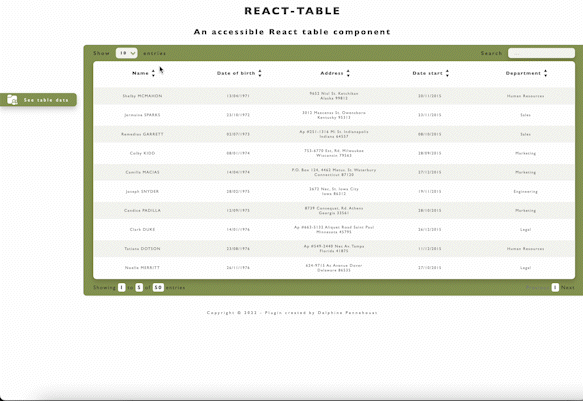
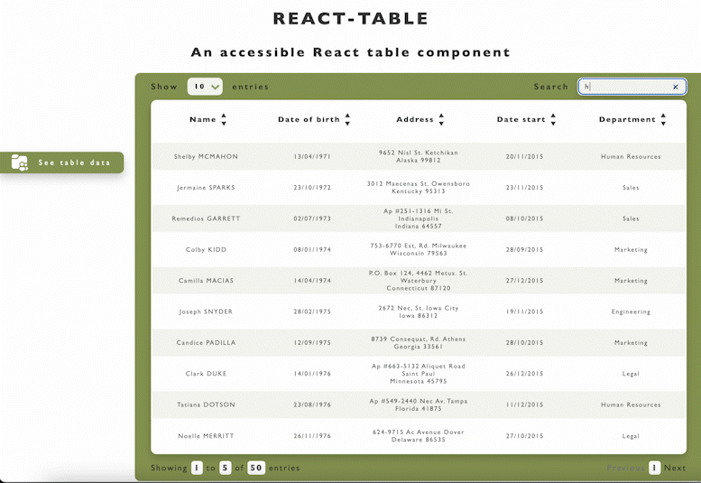

# TABLE REACT PLUGIN

`React component`


[](https://travis-ci.org/joemccann/dillinger)



## Table of Contents

- [Project](#Project)
- [Project technologies](#project-technologies)
- [Project prerequisites](#project-prerequisites)
- [Project installation](#project-installation)
- [Project starting](#project-starting)
- [Examples](#examples)
- [Props](#props)

## Project

---

A JavaScript table component for React Native allowing to simply display, sort, filter, paginate data.

## Project technologies

---

- [React](https://fr.reactjs.org/) (18.2.0)
- [Babel-cli](https://babeljs.io/) (6.26.0)

## Project prerequisites

---

- [Node.js](https://nodejs.org/) (12.18.0)
- [Yarn](https://classic.yarnpkg.com/lang/en/docs/install/#mac-stable) (1.22.19)

## Project installation

---

Install all the dependencies :

```sh
npm i @del83/plugin_table_p14
```

Import it into the project :

```sh
import Modal from "@del83/plugin_table_p14/dist";
```

## Project starting

---

Start using the front-end

```sh
yarn start
```

## Examples

---

Perhaps better than long paragraphs, here's a quick
preview of what you could achieve with plugin_modal_p14 in a few lines of code:

```sh
/** IMPORT REACT */
import React, { useEffect, useState } from "react";

/** COMPONENTS */
import Modal from "../lib/components/modal";
import Table from "../lib/index.js";

/** DATA et ASSETS */
import { DATA_MOCK } from "../lib/data/data_mock.js";
import { DATA_CATEGORIES } from "../lib/data/data-categories";
import iconViewWhite from "../lib/assets/icon_view_white.png"

/** STYLE */
import "../lib/styles/modal.css";
import "../lib/styles/layout.css";

/**
 * React component : Table with sorting, filtering and pagination
 * @component
 */
export default function App() {

  const dataMock = DATA_MOCK
  const categories = DATA_CATEGORIES
  const [currentPage, setCurrentPage] = useState(1);
  const [itemsPerPage, setItemsPerPage] = useState(10);
  const indexOfLastItem = itemsPerPage * currentPage;
  const indexOfFirstItem = indexOfLastItem - itemsPerPage;
  const [dataSorted, setDataSorted] = useState(dataMock);
  const [dataFiltered, setDataFiltered] = useState(dataMock);
  const [currentItems, setCurrentItems] = useState([]);
  const [searchInput, setSearchInput] = useState("");
  const [searchBar, setSearchBar] = useState(false);
  const [displayModal, setDisplayModal] = useState(false);
  const [messageModal, setMessageModal] = useState("");

  useEffect(() => {
    if (!searchBar) {
      setCurrentItems(dataSorted.slice(indexOfFirstItem, indexOfLastItem));
    } else if (searchBar) {
      if (currentPage !== 1) {
        setCurrentPage(1);
        setItemsPerPage((dataFiltered.length === 0) ? 10 : (dataFiltered.length))
        setCurrentItems(dataFiltered);
        //setCurrentItems(dataFiltered.slice(indexOfFirstItem, indexOfLastItem));
      } else {
        setItemsPerPage((dataFiltered.length === 0) ? 10 : (dataFiltered.length))
        setCurrentItems(dataFiltered);
        //setCurrentItems(dataFiltered.slice(indexOfFirstItem, indexOfLastItem));
      }
    }
    if (dataFiltered.length === 0) {
      setDisplayModal(true);
      setSearchBar(false);
      setDataFiltered(dataMock);
      setDataSorted(dataMock);
      setSearchInput("");
      return setMessageModal("No result");
    }
  }, [
    dataMock,
    dataSorted,
    dataFiltered,
    indexOfFirstItem,
    indexOfLastItem,
    currentPage,
    searchBar,
  ]);

  return (
    <div style={{ width: "100vw"}}>
      <header className="table-header">
        <h1 className="table-title">react-table</h1>
        <h2 className="table-subtitle">An accessible React table component</h2>
      </header>
      <section className="table-side">
      <div className="table-side-ctn">
        <div className="table-side-section active" to="/home">
          
          <h3 className="table-side-section-title">See table data</h3>
        </div>
      </div>
      </section>
      <main className="table-main">
      <Table
        dataSorted={dataSorted}
        setDataSorted={setDataSorted}
        dataFiltered={dataFiltered}
        setDataFiltered={setDataFiltered}
        currentItems={currentItems}
        currentPage={currentPage}
        setCurrentPage={setCurrentPage}
        itemsPerPage={itemsPerPage}
        searchInput={searchInput}
        setSearchInput={setSearchInput}
        categories={categories}
        setSelect={setItemsPerPage}
        searchBar={searchBar}
        setSearchBar={setSearchBar}
        className={"table-control-show"}
        classContent={"table-content-show"}
        classChevron={"chevron-show"}
      />
      <Modal
        displayModal={displayModal}
        setDisplayModal={setDisplayModal}
        messageModal={messageModal}
      />
      </main>
      <footer className="table-footer">
        <p>Copyright © 2022 - Plugin created by Delphine Pennehouat</p>
      </footer>
    </div>
  );
}
```

## Props

---

| Label           |   Type   | Required |       Default        |
| :-------------- | :------: | :------: | :------------------: |
| dataSorted      |  array   |   Yes    |         N/A          |
| setDataSorted   | function |   Yes    |         N/A          |
| dataFiltered    |  array   |   Yes    |         N/A          |
| setDataFiltered | function |   Yes    |         N/A          |
| currentItems    |  array   |   Yes    |         N/A          |
| currentPage     |  number  |   Yes    |          1           |
| setCurrentPage  | function |   Yes    |         N/A          |
| itemsPerPage    |   node   |    No    |          10          |
| searchInput     |  string  |   Yes    |         N/A          |
| setSearchInput  | function |   Yes    |         N/A          |
| categories      |  array   |   Yes    |         N/A          |
| setSelect       | function |   Yes    |         N/A          |
| searchBar       | boolean  |   Yes    |        False         |
| setSearchBar    | function |   Yes    |         N/A          |
| className       |  string  |   yes    | "table-control-show" |
| classContent    |  string  |   yes    | "table-content-show" |
| classChevron    |  string  |   yes    |    "chevron-show"    |
